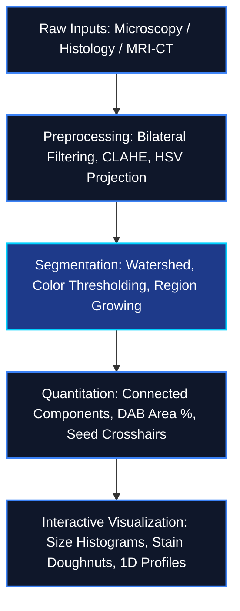

# MedInsight 3D: Medical Imaging AI & Clinical Analytics Platform

MedInsight 3D is an enterprise-grade interactive analytics platform designed to visualize and simulate advanced computer vision and image processing pipelines applied to multi-modal biomedical scans (Microscopy, Histopathology, MRI, CT).

---

## Problem Statement

In biomedical research and clinical workflows:
1. **Microscopy Analysis**: Manual cell counting and size profiling in fluorescence or brightfield images is slow, error-prone, and struggles to separate overlapping cell boundaries.
2. **Histopathology Scoring**: Grading IHC (Immunohistochemistry) staining area fractions is subjective, showing high inter-observer variability when identifying DAB positive regions.
3. **Volumetric CT/MRI Contouring**: Manually defining regions of interest in volumetric slices is labor-intensive, while static thresholding tools fail to adapt to local tissue gradients.

---

## The Solution

MedInsight 3D provides a unified analytics dashboard that:
1. **Automates Cell Profiling**: Integrates noise filtering and watershed morphological segmentation to count, measure, and analyze cell populations in real-time.
2. **Standardizes Tissue Grading**: Separates stains using HSV color space projections and computes automated IHC DAB scores.
3. **Enables Interactive MRI/CT Segmentation**: Combines CLAHE contrast optimization with seed-based region growing, allowing clinicians to click and segment anomalies dynamically.

---

## Supported Biomedical Modalities

### 1. Microscopy (Fluorescence/Brightfield)
* **Custom Pipeline**: Bilateral noise filtering, Otsu/manual thresholding, morphological separation of clustered cells, and connected components extraction.
* **Quantitation (Featurization)**: Computes cell counts, cell areas, boundary perimeters, circularity indices, signal intensities, and background Signal-to-Noise Ratio (SNR).
* **Analytics**: Real-time cell size distribution histogram.

### 2. Histopathology (H&E, IHC)
* **Custom Pipeline**: HSV-based color stain isolation. Segments Hematoxylin (nuclei) from Eosin (stroma) for tissue density calculations.
* **IHC Scoring**: Quantifies brown DAB positive staining area percentages, rendering an automated diagnostic grade (Negative, Weakly, Moderately, or Strongly Positive).
* **Analytics**: Doughnut chart illustrating staining area fraction.

### 3. MRI & CT Scans
* **Custom Pipeline**: CLAHE contrast optimization, bilateral border-preserving smoothing, and custom Seeded Region Growing segmentation.
* **Interactive Seed Selection**: Users can click directly on the axial MRI image slice to place seed coordinates, immediately triggering recalculation of the region growing mask.
* **Analytics**: 1D pixel intensity profile plot across the horizontal seed crosshair.

---

## Deep Learning Models & Applications

The platform utilizes specific deep learning architectures optimized for each clinical task:

### 1. 3D Attention U-Net
* **Task**: Multi-class Brain Tumor Segmentation (BraTS).
* **Modality**: Multi-sequence MRI (T1, T1c, T2, FLAIR).
* **Function**: Delineates three distinct tumor sub-compartments: necrotic core, active enhancing tumor, and peritumoral edema. The attention gates filter out non-tumor anatomical tissues, improving segmentation accuracy in boundary regions.

### 2. 3D ResNet-34
* **Task**: Solitary Pulmonary Nodule Malignancy Classification.
* **Modality**: Thoracic CT Scans.
* **Function**: Evaluates localized 3D lung nodules to output a malignancy probability score (benign vs. malignant classification). The 3D ResNet layers leverage volumetric spatial context to capture nodule border spiculations and density variations.

### 3. Dual-Path Cross-Attention Fusion Segmenter
* **Task**: Head & Neck Primary Carcinoma & Lymph Node Segmentation (Hecktor).
* **Modality**: Co-registered PET-CT.
* **Function**: Integrates anatomical structure from CT and metabolic glycolysis activity from PET. Parallel encoders process both modalities, and cross-attention blocks guide feature fusion to segment active tumor lesions and regional lymph nodes.

---

## System Architecture



---

## Biomedical Datasets

To train deep learning vision models or scale these algorithms, access the following public benchmark collections:

### Microscopy
*   **[BBBC038: 2018 Data Science Bowl (Nuclei Segmentation)](https://data.broadinstitute.org/bbbc/BBBC038/)** - Broad Bioimage Benchmark Collection dataset containing highly annotated nuclei across diverse biological domains.
*   **[BBBC005: Synthetic Cells (Focus Blur)](https://data.broadinstitute.org/bbbc/BBBC005/)** - Simulated microscopy image sets containing variable focus blur, used to validate segmentation and counting robustness.

### Histopathology
*   **[MoNuSeg Dataset (Multi-Organ Nuclei Segmentation)](https://monuseg.grand-challenge.org/)** - H&E stained pathology tissue slides captured at 40x magnification from TCGA, annotated for nuclear boundary segmentation.
*   **[PatchCamelyon (PCam) Dataset](https://github.com/basveeling/pcam)** - 327,680 histopathologic patches of H&E slides used for metastatic cancer detection models.

### MRI & CT Scans
*   **[Brain MRI LGG Segmentation (Kaggle)](https://www.kaggle.com/datasets/mateuszbuda/lgg-mri-segmentation)** - Lower-Grade Glioma brain MR images (FLAIR sequences) containing manual tumor segmentation masks.
*   **[IXI Dataset (Information Extraction from Images)](http://brain-development.org/ixi-dataset/)** - Structural brain magnetic resonance scans (T1, T2, PD, DTI) of nearly 600 healthy adult subjects.

---

## Setup & Execution

### Prerequisites
Make sure you have Python 3.8+ installed on your system.

### 1. Install Dependencies
Navigate to the project root directory and run:
```bash
pip install -r requirements.txt
```

### 2. Start the Local Server
Run the FastAPI application via Uvicorn:
```bash
python -m uvicorn app.main:app --reload
```
*Alternatively, you can run:*
```bash
python app/main.py
```

### 3. Open the Dashboard
Open your web browser and go to:
**http://localhost:8000**

*Note: On first startup, the platform will automatically generate high-quality synthetic samples under `app/samples/` to make the dashboard immediately interactive. You can also upload your own images (.tif, .png, .jpg) via the sidebar.*
